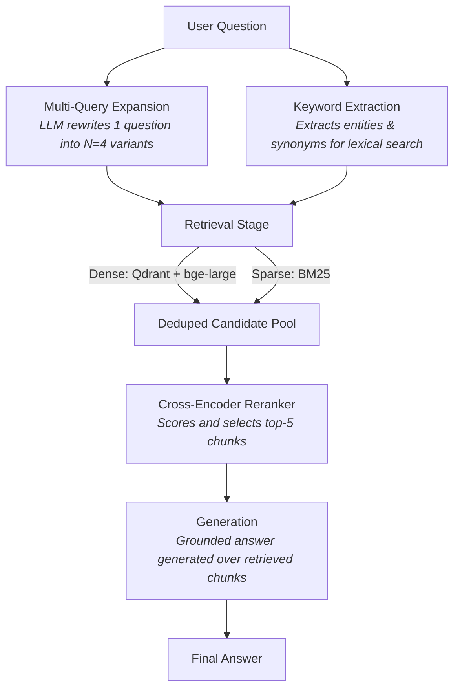

# Askit RAG 🚀

A production-grade, highly optimized biomedical RAG built over the **RAGBench COVID-QA** corpus. Askit RAG is validated incrementally with [Opik](https://www.comet.com/docs/opik/) experiments and features a stunning, glassmorphism UI designed for modern luxury.

---

## 🏗 Architecture

Askit utilizes a multi-stage retrieval architecture designed for both high recall and high precision.



### The Retrieval Stack in Detail:
1. **Multi-Query Expansion (Recall Engine):** Expands the user's query into 4 domain-aware variants.
2. **Keyword Extraction (Precision Engine):** Identifies exact entities (like "SARS-CoV-2") to feed directly into BM25.
3. **Hybrid Search:** Combines dense retrieval (`Qdrant` with `bge-large`) and sparse lexical retrieval (`BM25`).
4. **Reranking:** Uses an on-device `cross-encoder/ms-marco-MiniLM-L6-v2` to definitively score the retrieved chunks.

Every stage was validated with a dedicated Opik experiment on a 50-question test split:

| Change | ContextRecall | ContextPrecision | AnswerRelevance | Hallucination |
|---|---|---|---|---|
| BM25 baseline | 0.354 | — | 0.659 | — |
| + Dense embeddings | 0.500 | — | 0.829 | — |
| + Reranker | 0.517 | — | 0.859 | — |
| + Keyword BM25 extraction | **0.587** | **0.544** | **0.844** | **0.085** |

---

## 🛠 Tech Stack

- **Serving**: FastAPI + LangGraph (async, highly parallel)
- **Vector Store**: Qdrant Cloud (cosine similarity)
- **Embeddings**: Fireworks API (`nomic-ai/nomic-embed-text-v1`)
- **Lexical Search**: `rank-bm25` (cached locally)
- **Reranker**: `cross-encoder/ms-marco-MiniLM-L6-v2` (on-device via sentence-transformers)
- **LLM**: Fireworks (OpenAI-compatible) + Vision models for OCR on scanned PDFs
- **Asynchronous Ingestion**: Built-in Daemon thread using LangGraph (with AWS SQS fallback capability)
- **Frontend**: Next.js 15 (App Router) + Tailwind + Framer Motion (Premium UI)
- **Observability**: Opik (trace per request, session threading, evaluation caching)

---

## ⚙️ How It Works

### Asynchronous Ingestion & Document Processing
Documents are uploaded to the platform (up to 5 PDFs per user, max 10 pages each). The backend processes them asynchronously:
1. If the PDF is scanned (sparse text layer), it runs through a **Vision LLM** to recover text.
2. The text is chunked and embedded.
3. Chunks are upserted to Qdrant (Dense) and added to the user's localized BM25 index (Sparse).

### Background Evaluation Pipeline
Upon server startup, the backend automatically spins up a background thread that triggers the `run_eval_pipeline_if_needed()` function. This evaluates the system against the COVID-QA test dataset. 
- Results are **cached in SQLite**. 
- The system checks the cache before running to ensure we don't redundantly re-run expensive eval pipelines on every container restart.

---

## 🚀 Quick Setup & Deployment

The easiest way to run Askit RAG is via `docker-compose`.

### 1. Configure Environment

```bash
# Clone the repository
git clone https://github.com/your-username/askit-rag.git
cd askit-rag

# Setup backend env
cp backend/.env.example backend/.env

# Setup frontend env
cp frontend/.env.example frontend/.env.local
```

Ensure you fill out the following keys in `backend/.env`:
- `FIREWORKS_API_KEY`
- `QDRANT_URL` and `QDRANT_API_KEY`
- `OPIK_API_KEY`, `OPIK_WORKSPACE`, `OPIK_PROJECT_NAME`
- `JWT_SECRET` (generate a random string)

### 2. Deploy with Docker Compose

```bash
docker-compose up --build
```
This will start:
- **Backend API:** `http://localhost:3001`
- **Frontend UI:** `http://localhost:3000`

### 3. Usage

1. Open your browser to `http://localhost:3000`.
2. Register a new account.
3. View the **Experiment** tab to see your cached evaluation metrics.
4. Upload documents via the **Documents** tab.
5. Head to the **Ask** tab and start querying! Your retrieval is tightly scoped to your uploaded documents.

---

## 📁 Project Layout

```text
├── backend/
│   ├── app/
│   │   ├── agent/            # LangGraph: nodes, state, compiled graph
│   │   ├── api/              # Routers (ask, ingest, eval, auth)
│   │   ├── core/             # LLMs, embeddings, vision, prompts
│   │   ├── db/               # Qdrant, retrievers, loaders, users
│   │   ├── evaluation/       # Opik eval harness + sqlite cache
│   │   └── ingest_worker/    # Async worker LangGraph for document processing
│   ├── Dockerfile
│   └── .env
├── frontend/                 # Next.js 15 UI (Premium aesthetic)
│   ├── app/                  # Next.js routing (login, register, dashboard)
│   ├── components/           # Reusable UI components (Sidebar, Chat, Bento)
│   └── Dockerfile
└── docker-compose.yml
```
